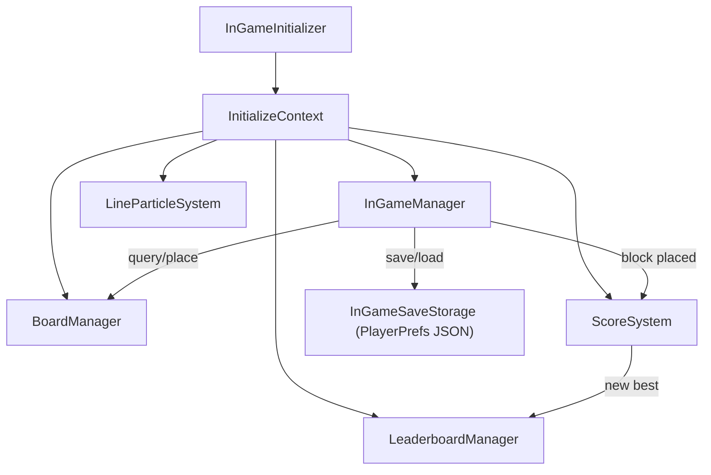
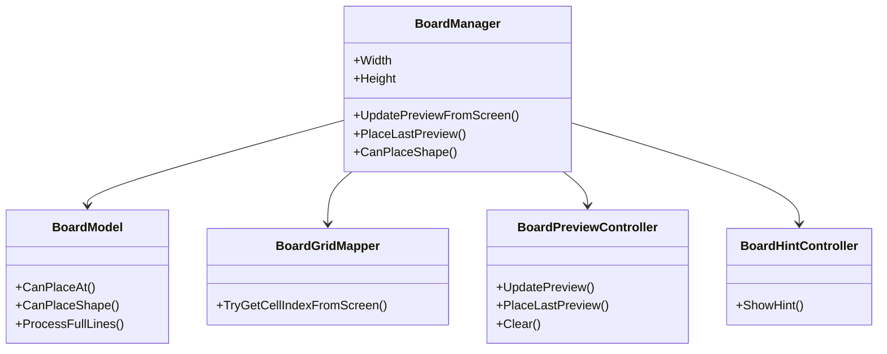
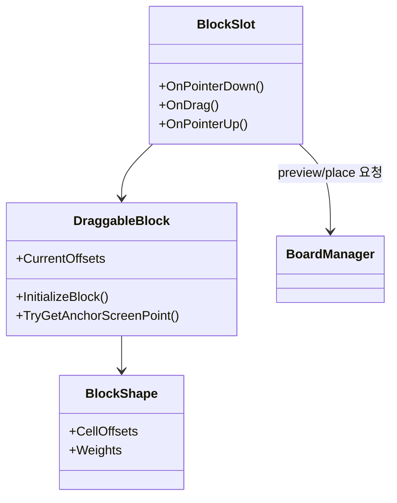

# BlockPuzzle

---

## Project Overview
- 9x9 보드에 블록을 드래그해 배치하고 가로/세로 라인을 완성해 점수 올리는 퍼즐 게임
- 드래그 중 배치 가능 위치 프리뷰, 일정 시간 이후 힌트 표시, 콤보 점수/이펙트, 게임오버 연출
- PlayerPrefs 기반 로컬 저장(보드 상태, 슬롯 블록, 점수 진행)과 로컬+서버 최고 점수 연동
- **구글 플레이 스토어**: 현재 검토 완료 후 14일 테스트 기간으로 출시 후 링크 추가 예정
- **개발 기간**: 2025.12 ~ 2026.04
- **인원**: 개인 프로젝트

---

## Tech Stack

| 구분 | 선택 |
|------|------|
| Engine | Unity 6 (`6000.3.9f1`) |
| Rendering | URP
| Input | Unity Input System |
| UI/Animation | UGUI, TextMeshPro, DOTween |
| Data | PlayerPrefs + JSON Serialization (`JsonUtility`) |
| Backend | BackEnd SDK (구글 페더레이션 로그인, 랭킹/게임데이터) |

---

## Controls

| 구분 | 조작 |
|------|------|
| **인게임 기본 조작** | 블록 클릭/드래그/드롭으로 보드에 배치 |
| **프리뷰** | 드래그 중 배치 가능한 칸에 미리보기 표시 |
| **힌트** | 블록 선택 후 5초 후배치 가능한 위치에 힌트 표시 |

---

## Implementation Details

### 1. 보드 로직 분리 (Manager / Model / Mapper / Controller)
- `BoardManager`: 씬 오브젝트 생성과 이벤트 연결을 담당, 실제 판정은 `BoardModel`에서 처리
- `BoardGridMapper`: Screen 좌표를 보드 인덱스로 변환
- `BoardPreviewController`: 드래그 프리뷰 상태 관리
- `BoardHintController`: 마지막 배치 가능 좌표를 기준으로 힌트 표시/해제

### 2. 블록 생성과 배치 UX
- `DraggableBlock`에서 `BlockShape`(ScriptableObject) 오프셋을 기반으로 블록 형태 구성
- Shape 가중치(`Weights`) 기반 랜덤 선택 + 랜덤 회전 후 정규화로 블록 변형 생성
- `BlockSlot`이 포인터 이벤트를 받아 프리뷰 갱신, 최종 배치, 실패 복귀, 사운드 재생 처리

### 3. 점수/콤보 시스템
- `ScoreSystem`(ScriptableObject)에서 배치 점수, 라인 클리어 점수, 멀티라인 보너스, 콤보 보너스 계산
- 점수 변경 이벤트(`OnScoreChanged`)로 UI를 갱신하고 보너스 이벤트(`OnBonusScore`)로 연출 트리거 분리
- 최고 점수 갱신 여부를 이벤트로 전달해 게임오버 배너 표시를 제어

### 4. 저장/로드
- `InGameManager`: 보드 채움 상태, 슬롯 블록(sprite/offset), 점수 상태를 `InGameSaveData`로 직렬화
- 저장은 `PlayerPrefs` 문자열(JSON)로 처리, 시작 시 로드 성공 여부로 이어하기/새 게임 으로 분기 처리
- 앱 일시정지/종료 시 자동 저장

### 5. 라인 클리어 연출과 오브젝트 풀링
- `LineParticleSystem`이 클리어된 행/열 이벤트를 받아 파티클 재생
- `LineParticlePoolManager`(Unity `ObjectPool`)로 파티클 프리웜/재사용 구현해 런타임 생성 비용 감소
- 마지막으로 배치한 블록 스프라이트 키를 기반으로 파편 스프라이트 매칭

### 6. 로비/리더보드/로그인 구성
- `GoogleLoginManager`에서 구글 로그인 후 BackEnd 페더레이션 로그인 수행
- `LeaderboardManager`가 로컬 최고점(PlayerPrefs)과 서버 데이터(`BEST_SCORE` 테이블) 동기화
- 랭킹 조회 결과를 `LeaderboardUI`에서 보여줌
- 유저 고유 UUID의 앞 4자리를 조합한 기본 닉네임(Player_XXXX) 자동 생성, 닉네임 변경 가능

---

## Class Diagram

### 런타임 초기화/핵심 매니저

### 보드 도메인 구조

### 블록 생성/배치 흐름

---

## Play

### 실행
1. [BlockPuzzleReleases](https://github.com/chlghksgml01/BlockPuzzle/releases/tag/1.0) BlockPuzleBuild.zip 다운로드
2. 압축 해제 후 BlockPuzzle.exe 실행

### 빌드
1. Unity Version: `6000.3.9f1` (동일 / 마이너에 가깝게 맞춰 실행)
2. 시작 씬: Assets/0Scenes/Loading.unity
3. 흐름: `Loading` -> `Lobby` -> `InGame`
4. 모바일 환경에 최적화되어 있으므로 유니티 에디터 내 테스트 시 Game 뷰 대신 Simulator 뷰 사용 권장
