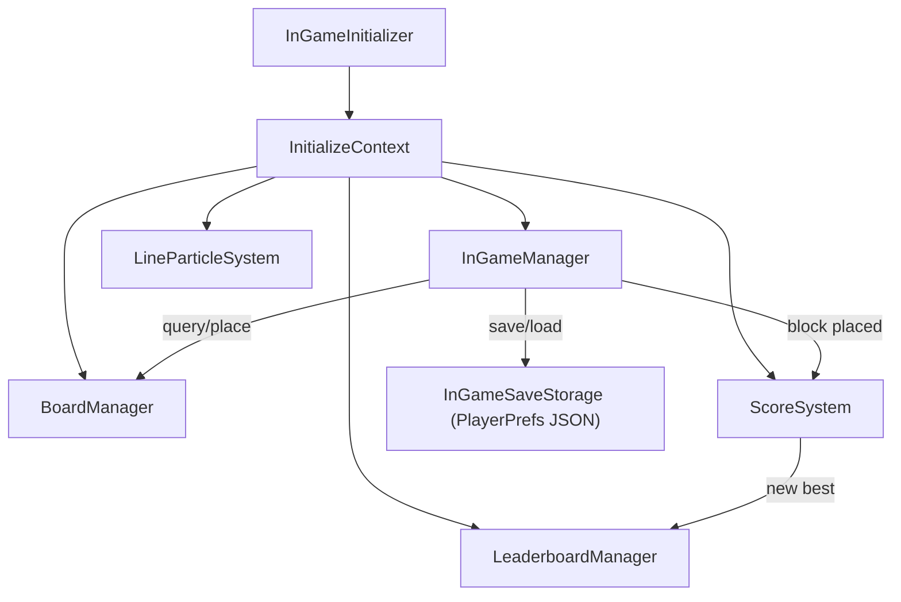
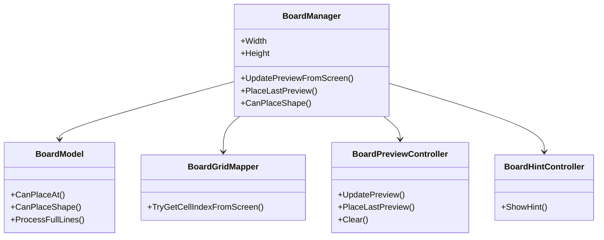
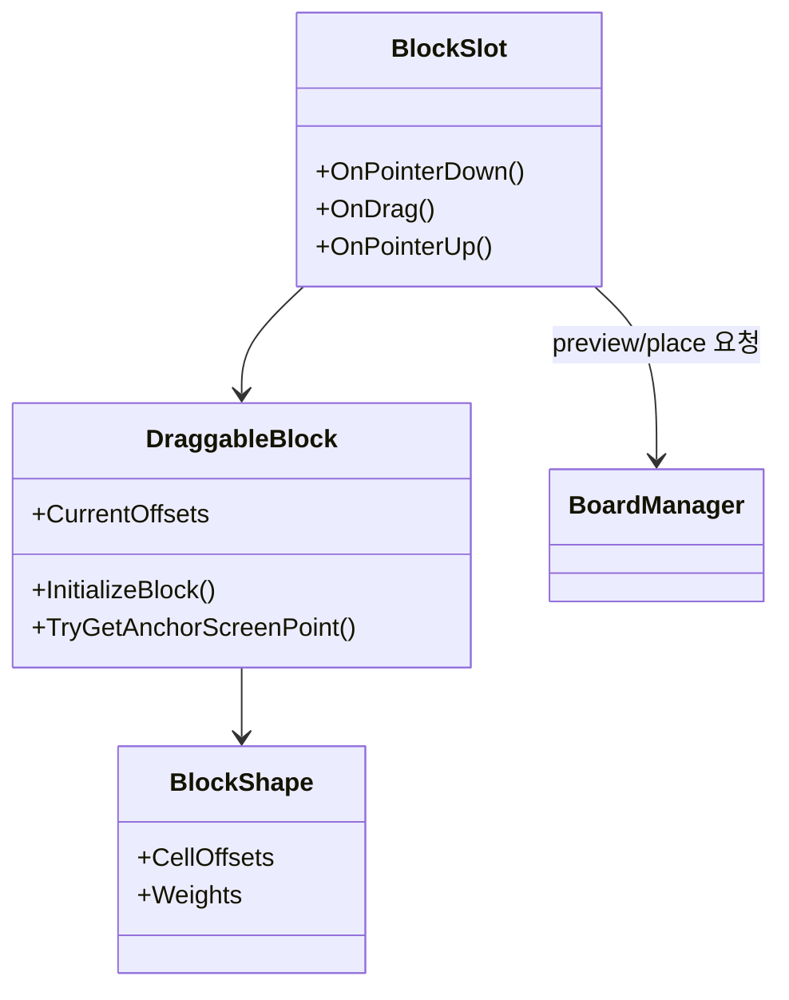

# BlockPuzzle

---

## Project Overview
- 9x9 보드에 블록을 드래그해 배치하고, 가로/세로 라인을 완성해 점수를 올리는 퍼즐 게임입니다.
- 드래그 중 배치 가능 위치 프리뷰, 일정 시간 이후 힌트 표시, 콤보 점수/이펙트, 게임오버 연출을 포함합니다.
- PlayerPrefs 기반 로컬 저장(보드 상태, 슬롯 블록, 점수 진행)과 로컬+서버 최고 점수 연동을 구현했습니다.
- **시연 영상**: 추후 추가
- **개발 기간**: 미기재
- **인원**: 개인 프로젝트

---

## Tech Stack

| 구분 | 선택 |
|------|------|
| Engine | Unity 6 (`6000.3.9f1`) |
| Rendering | URP (`com.unity.render-pipelines.universal` `17.3.0`) |
| Input | Unity Input System (`com.unity.inputsystem` `1.18.0`) |
| UI/Animation | UGUI, TextMeshPro, DOTween |
| Data | PlayerPrefs + JSON Serialization (`JsonUtility`) |
| Backend | BackEnd SDK (구글 페더레이션 로그인, 랭킹/게임데이터) |
| Platform Feature | Android 진동 연동 (`AndroidJavaObject`) |

---

## Controls

| 구분 | 조작 |
|------|------|
| **인게임 기본 조작** | 블록 **클릭/드래그/드롭**으로 보드에 배치 |
| **프리뷰** | 드래그 중 배치 가능한 칸에 미리보기 표시, 불가 시 원위치 복귀 |
| **힌트** | 블록을 잡고 일정 시간(기본 5초) 유지 시 추천 위치 힌트 표시 |
| **옵션 패널** | `Esc`: 인게임에서 설정 패널 열기/닫기 |
| **로비 동작** | `Esc`: 닉네임 UI 닫기 → 리더보드 닫기 → 앱 종료 |
| **설정** | 사운드 On/Off, 진동 On/Off 토글 |

---

## Implementation Details

### 1. 보드 로직 분리 (Manager / Model / Mapper / Controller)
- `BoardManager`가 씬 오브젝트 생성과 이벤트 연결을 담당하고, 실제 판정은 `BoardModel`에서 처리합니다.
- `BoardGridMapper`가 Screen 좌표를 보드 인덱스로 변환하고, `BoardPreviewController`가 드래그 프리뷰 상태를 관리합니다.
- `BoardHintController`가 마지막 배치 가능 좌표를 기준으로 힌트를 표시/해제합니다.

### 2. 블록 생성과 배치 UX
- `DraggableBlock`에서 `BlockShape`(ScriptableObject) 오프셋을 기반으로 블록 형태를 구성합니다.
- Shape 가중치(`Weights`) 기반 랜덤 선택 + 랜덤 회전 후 정규화로 블록 변형을 만듭니다.
- `BlockSlot`이 포인터 이벤트를 받아 프리뷰 갱신, 최종 배치, 실패 복귀, 사운드 재생을 처리합니다.

### 3. 점수/콤보 시스템
- `ScoreSystem`(ScriptableObject)에서 배치 점수, 라인 클리어 점수, 멀티라인 보너스, 콤보 보너스를 계산합니다.
- 점수 변경 이벤트(`OnScoreChanged`)로 UI를 갱신하고, 보너스 이벤트(`OnBonusScore`)로 연출 트리거를 분리했습니다.
- 최고 점수 갱신 여부를 이벤트로 전달해 게임오버 배너 표시를 제어합니다.

### 4. 저장/로드 및 세션 흐름
- `InGameManager`가 보드 채움 상태, 슬롯 블록(sprite/offset), 점수 상태를 `InGameSaveData`로 직렬화합니다.
- 저장은 `PlayerPrefs` 문자열(JSON)로 처리하고, 시작 시 로드 성공 여부로 이어하기/새 게임 흐름을 나눕니다.
- 앱 일시정지/종료 시 자동 저장하도록 연결했습니다.

### 5. 라인 클리어 연출과 오브젝트 풀링
- `LineParticleSystem`이 클리어된 행/열 이벤트를 받아 파티클을 재생합니다.
- `LineParticlePoolManager`(Unity `ObjectPool`)로 파티클 프리웜/재사용을 구현해 런타임 생성 비용을 줄였습니다.
- 마지막으로 배치한 블록 스프라이트 키를 기반으로 파편 스프라이트를 매칭합니다.

### 6. 로비/리더보드/로그인 구성
- `GoogleLoginManager`에서 구글 로그인 후 BackEnd 페더레이션 로그인을 수행합니다.
- `LeaderboardManager`가 로컬 최고점(PlayerPrefs)과 서버 데이터(`BEST_SCORE` 테이블)를 동기화합니다.
- 랭킹 조회 결과를 `LeaderboardUI`에서 렌더링하고, 닉네임 미설정 시 `NicknameUI` 플로우를 제공합니다.

---

## Class Diagram

### 런타임 초기화/핵심 매니저

### 보드 도메인 구조

### 블록 생성/배치 흐름

---

## Play

### 실행
1. Unity에서 `0.Scenes/Loading.unity`를 시작 씬으로 실행
2. 씬 흐름: `Loading` -> `Lobby` -> `InGame`

### 빌드
1. Unity Version: `6000.3.9f1`
2. 모바일(Android) 기준으로 사운드/진동 및 백엔드 로그인 동작 확인 권장
