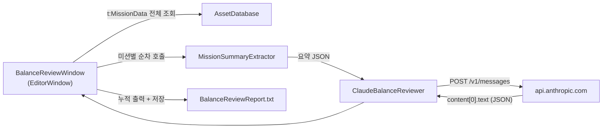
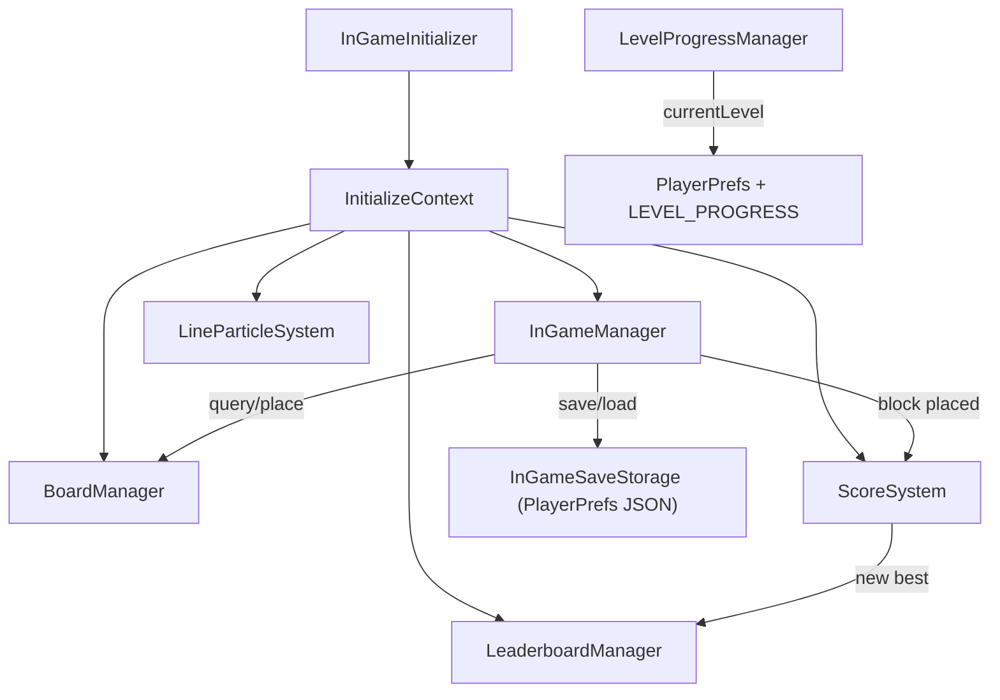
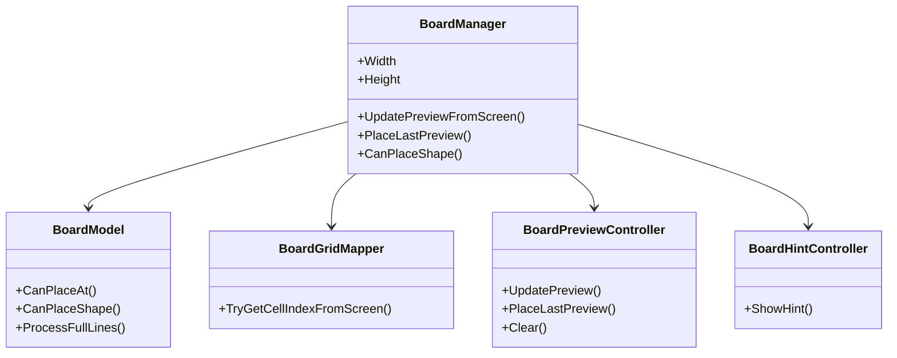
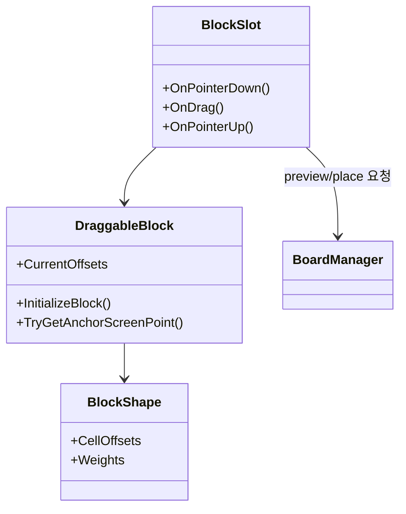

# BlockPuzzle

---

## Project Overview
- 9x9 보드에 블록을 드래그해 배치하고 가로/세로 라인을 완성해 점수 올리는 퍼즐 게임
- 드래그 중 배치 가능 위치 프리뷰, 일정 시간 이후 힌트 표시, 콤보 점수/이펙트, 게임오버 연출
- PlayerPrefs 기반 로컬 저장(보드 상태, 슬롯 블록, 점수 진행)과 로컬+서버 최고 점수 연동
- **구글 플레이 스토어**: https://play.google.com/store/apps/details?id=com.HwanHee.BlockPuzzle
- **개발 기간**: 2025.12 ~ 2026.04
- **인원**: 개인 프로젝트

---

## Tech Stack

| 구분 | 선택 |
|------|------|
| Engine | Unity 6 (`6000.3.9f1`) |
| Rendering | URP
| Input | Unity Input System |
| UI/Animation | UGUI, TextMeshPro, DOTween |
| Data | PlayerPrefs + JSON Serialization (`JsonUtility`) |
| Backend | BackEnd SDK (구글 페더레이션 로그인, 랭킹/게임데이터) |
| AI Tooling | Anthropic Messages API (에디터 미션 밸런스 검수) |


---

## Controls

| 구분 | 조작 |
|------|------|
| **인게임 기본 조작** | 블록 클릭/드래그/드롭으로 보드에 배치 |
| **프리뷰** | 드래그 중 배치 가능한 칸에 미리보기 표시 |
| **힌트** | 블록 선택 후 5초 후배치 가능한 위치에 힌트 표시 |

---
## AI 밸런스 검수 (Claude API)

미션(`MissionData`) 에셋의 난이도 밸런스를 **Anthropic Messages API**로 검수하는 Unity 에디터 툴
(`Assets/1.Scripts/Editor/AIBalanceReview/`)

### 흐름


```mermaid
flowchart LR
    W["BalanceReviewWindow<br/>(EditorWindow)"] -->|"t:MissionData 전체 조회"| A["AssetDatabase"]
    W -->|"미션별 순차 호출"| EX["MissionSummaryExtractor"]
    EX -->|"요약 JSON"| R["ClaudeBalanceReviewer"]
    R -->|"POST /v1/messages"| API["api.anthropic.com"]
    API -->|"content[0].text (JSON)"| R
    R --> W
    W -->|"누적 출력 + 저장"| TXT["BalanceReviewReport.txt"]
```

### 구성

| 클래스 | 역할 |
|--------|------|
| `MissionSummaryExtractor` | `MissionData` ScriptableObject에서 검수에 필요한 필드(`boardSize`, `missionType`, `isHard`, `filledCellCount`, `iceCellCount`, `grassCellCount`, `targetScore`, `gemTargets`)만 뽑아 요약 JSON 생성<br>에셋 전체를 넘기지 않아 토큰과 노이즈를 줄임 |
| `ClaudeBalanceReviewer` | Messages API 호출 담당. 프롬프트 구성 → 요청 → 응답에서 `content[0].text` 추출 |
| `BalanceReviewWindow` | 메뉴 `BlockPuzzle/AI 밸런스 검수`<br>모든 미션을 순회하며 검수하고 결과를 창에 누적 출력 + `BalanceReviewReport.txt`로 저장 |

### 구현 노트

- API 키는 `ANTHROPIC_API_KEY` 환경변수에서 로드: 소스에 하드코딩하지 않음
- `static readonly HttpClient` 재사용: 매 호출마다 생성 시 소켓 고갈(포트 소진) 위험이 있어 인스턴스 하나를 공유, `Timeout` 60초
- 비동기 순차 처리 — `RunReviewAll`이 `MissionData` 에셋을 for 루프로 돌며 `await ReviewMissionAsync`를 순차 호출, `_isRunning` 플래그로 중복 실행 차단해 에디터 UI 스레드를 막지 않음
- 도메인 규칙을 주입한 프롬프트(`BuildReviewPrompt`) — "밸런스 봐줘" 한 줄이 아니라
  - 게임 룰(라인 클리어 / Game Over 조건) 명시
  - Ice / Grass / Gem / ScoreGoal 미션 타입별로 클리어 조건·관련 필드·무시할 필드·판단 기준을 분리 서술
  - `DO NOTs` 목록으로 모델이 흔히 저지르는 오탐(예: Ice 셀 수가 적다고 목적 불분명 지적, ScoreGoal 아닌데 `targetScore` 0을 문제 삼기)을 사전 차단
  - 응답을 `{missionName, riskLevel, issues[], suggestion}` JSON 스키마로 강제
- 에디터 전용 툴이라 런타임 게임 로직과는 분리되어 있음

### 출력 예시 (`BalanceReviewReport.txt`)

```json
[MissionData3]
{"missionName":"MissionData3","riskLevel":"high",
 "issues":["targetScore of 800 is extremely low for a 10x10 board. A single line clear yields approximately 50 points (boardSize * 5) ... inconsistent with isHard=true."],
 "suggestion":"Increase targetScore significantly (e.g., 5000-10000) to match the isHard flag, or set isHard to false."}
```

---

## Implementation Details

### 1. 보드 로직 분리 (Manager / Model / Mapper / Controller)
- `BoardManager`: 씬 오브젝트 생성과 이벤트 연결을 담당, 실제 판정은 `BoardModel`에서 처리
- `BoardGridMapper`: Screen 좌표를 보드 인덱스로 변환
- `BoardPreviewController`: 드래그 프리뷰 상태 관리
- `BoardHintController`: 마지막 배치 가능 좌표를 기준으로 힌트 표시/해제

### 2. 블록 생성과 배치 UX
- `DraggableBlock`에서 `BlockShape`(ScriptableObject) 오프셋을 기반으로 블록 형태 구성
- Shape 가중치(`Weights`) 기반 랜덤 선택 + 랜덤 회전 후 정규화로 블록 변형 생성
- `BlockSlot`이 포인터 이벤트를 받아 프리뷰 갱신, 최종 배치, 실패 복귀, 사운드 재생 처리
- 보드의 점유율이 50% 이상일 때 대형(5칸 이상) 블록 가중치는 낮추고, 소형(3칸 이하) 블록 가중치는 높인다

### 3. 점수/콤보 시스템
- `ScoreSystem`(ScriptableObject)에서 배치 점수, 라인 클리어 점수, 멀티라인 보너스, 콤보 보너스 계산
- 점수 변경 이벤트(`OnScoreChanged`)로 UI를 갱신하고 보너스 이벤트(`OnBonusScore`)로 연출 트리거 분리
- 최고 점수 갱신 여부를 이벤트로 전달해 게임오버 배너 표시를 제어
- 최고 점수(`BestScore`)는 Classic에서만 저장한다. LevelInGame 점수는 리더보드에 반영하지 않음

### 4. 저장/로드
- `InGameManager`: 보드 채움 상태, 슬롯 블록(sprite/offset), 점수 상태를 `InGameSaveData`로 직렬화
- 저장은 `PlayerPrefs` 문자열(JSON)로 처리, 시작 시 로드 성공 여부로 이어하기/새 게임 으로 분기 처리
- 앱 일시정지/종료 시 자동 저장

### 5. 라인 클리어 연출과 오브젝트 풀링
- `LineParticleSystem`이 클리어된 행/열 이벤트를 받아 파티클 재생
- `LineParticlePoolManager`(Unity `ObjectPool`)로 파티클 프리웜/재사용 구현해 런타임 생성 비용 감소
- 마지막으로 배치한 블록 스프라이트 키를 기반으로 파편 스프라이트 매칭

### 6. 로비/리더보드/로그인 구성
- `GoogleLoginManager`에서 구글 로그인 후 BackEnd 페더레이션 로그인 수행
- `LeaderboardManager`가 로컬 최고점(PlayerPrefs)과 서버 데이터(`BEST_SCORE` 테이블) 동기화
- `LevelProgressManager`가 현재 플레이 레벨(`currentLevel`)을 PlayerPrefs와 서버(`LEVEL_PROGRESS` 테이블)에 Max 병합 동기화
- 랭킹 조회 결과를 `LeaderboardUI`에서 보여줌
- 유저 고유 UUID의 앞 4자리를 조합한 기본 닉네임(Player_XXXX) 자동 생성, 닉네임 변경 가능

---

## Class Diagram

### 런타임 초기화/핵심 매니저


```mermaid
flowchart TB
    INIT["InGameInitializer"] --> CTX["InitializeContext"]
    CTX --> IGM["InGameManager"]
    CTX --> BM["BoardManager"]
    CTX --> SS["ScoreSystem"]
    CTX --> LM["LeaderboardManager"]
    CTX --> SPS["LineParticleSystem"]

    IGM -->|"block placed"| SS
    IGM -->|"save/load"| SAVE["InGameSaveStorage (PlayerPrefs JSON)"]
    IGM -->|"query/place"| BM
    SS -->|"new best"| LM

    LPM["LevelProgressManager"] -->|"currentLevel"| LPSAVE["PlayerPrefs + LEVEL_PROGRESS"]
```

### 보드 도메인 구조


```mermaid
classDiagram
    class BoardManager {
        +Width
        +Height
        +UpdatePreviewFromScreen()
        +PlaceLastPreview()
        +CanPlaceShape()
    }

    class BoardModel {
        +CanPlaceAt()
        +CanPlaceShape()
        +ProcessFullLines()
    }

    class BoardGridMapper {
        +TryGetCellIndexFromScreen()
    }

    class BoardPreviewController {
        +UpdatePreview()
        +PlaceLastPreview()
        +Clear()
    }

    class BoardHintController {
        +ShowHint()
    }

    BoardManager --> BoardModel
    BoardManager --> BoardGridMapper
    BoardManager --> BoardPreviewController
    BoardManager --> BoardHintController
```

### 블록 생성/배치 흐름


```mermaid
classDiagram
    class BlockSlot {
        +OnPointerDown()
        +OnDrag()
        +OnPointerUp()
    }

    class DraggableBlock {
        +CurrentOffsets
        +InitializeBlock()
        +TryGetAnchorScreenPoint()
    }

    class BlockShape {
        +CellOffsets
        +Weights
    }

    BlockSlot --> DraggableBlock
    DraggableBlock --> BlockShape
    BlockSlot --> BoardManager : preview/place 요청
```

---

## Play

### 실행
1. [BlockPuzzleReleases](https://github.com/chlghksgml01/BlockPuzzle/releases/tag/1.0) BlockPuzleBuild.zip 다운로드
2. 압축 해제 후 BlockPuzzle.exe 실행
* 모바일 환경에 최적화되어 있으므로 비율이 깨질 수 있는 점 양해 부탁드립니다.


### 빌드
1. Unity Version: `6000.3.9f1` (동일 / 마이너에 가깝게 맞춰 실행)
2. 시작 씬: Assets/0Scenes/Loading.unity
3. 흐름: `Loading` -> `Lobby` -> `InGame`
* 모바일 환경에 최적화되어 있으므로 유니티 에디터 내 테스트 시 Game 뷰 대신 Simulator 뷰 사용 권장
