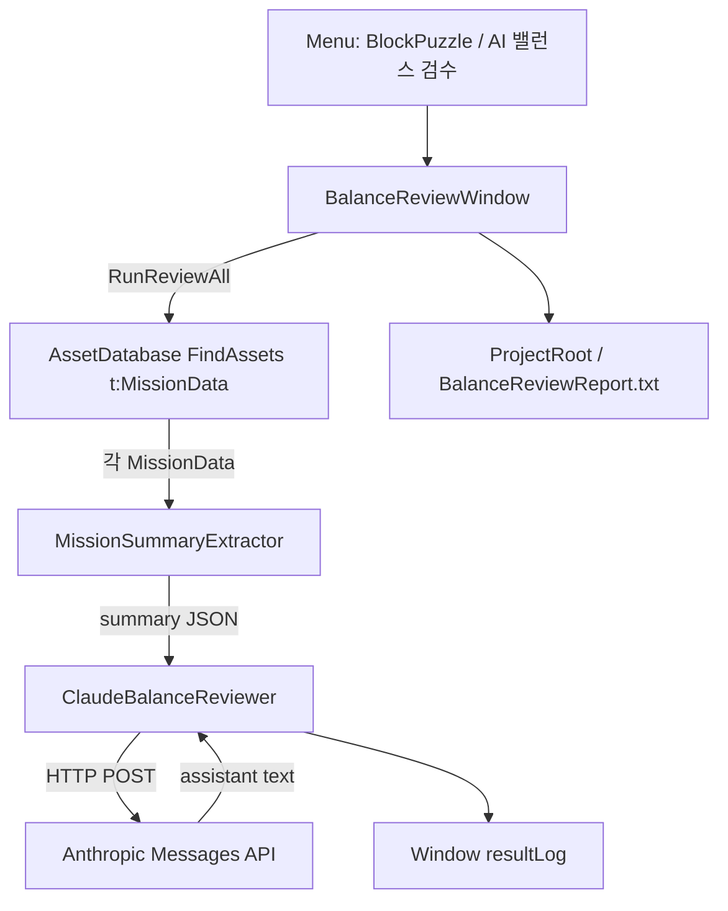
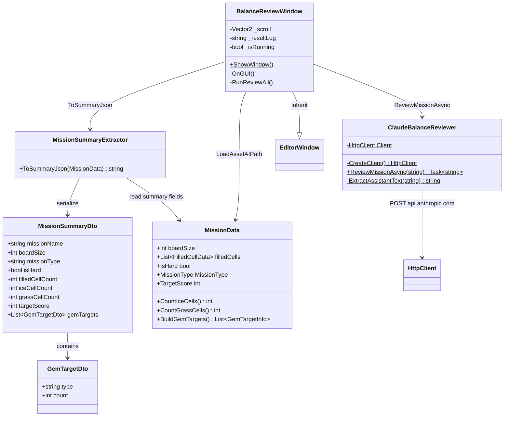

# AI Balance Review (에디터)

에디터 전용 미션 밸런스 검수 툴. 프로젝트의 모든 `MissionData`를 요약 JSON으로 만든 뒤 Anthropic Claude API에 보내고, 난이도·목표 현실성 이슈를 로그/리포트로 남긴다. **런타임 플레이어 빌드에는 포함되지 않는다.**

경로: `Assets/1.Scripts/Editor/AIBalanceReview/`

## 책임 분리

| 클래스 | 책임 |
|--------|------|
| `BalanceReviewWindow` | EditorWindow UI, 미션 순회, 결과 표시/파일 저장 |
| `MissionSummaryExtractor` | `MissionData` → 검수용 요약 JSON (DTO 직렬화) |
| `ClaudeBalanceReviewer` | Messages API 호출, `content[0].text` 추출 |

## 흐름



## 검수 기준 (프롬프트)

Claude에게 아래만 JSON으로 답하도록 요청한다.

1. `isHard`와 실제 난이도(보드 크기, 채움 칸, 목표 점수) 일치 여부
2. `gemTargets`가 `filledCellCount` 대비 과도한지 (클리어 불가 위험)
3. `targetScore`가 `boardSize` 대비 과소/과대인지

예상 응답 스키마:

```json
{
  "missionName": "string",
  "riskLevel": "low|medium|high",
  "issues": ["string"],
  "suggestion": "string"
}
```

## 요약 JSON 필드

`MissionSummaryExtractor`가 보내는 필드:

| 필드 | 출처 |
|------|------|
| `missionName` | 에셋 이름 |
| `boardSize` | `MissionData.boardSize` |
| `missionType` | `MissionType` |
| `isHard` | `IsHard` |
| `filledCellCount` | `filledCells.Count` |
| `iceCellCount` / `grassCellCount` | `CountIceCells` / `CountGrassCells` |
| `targetScore` | `TargetScore` |
| `gemTargets[]` | `BuildGemTargets()` → `{ type, count }` |

보드 셀 좌표·스프라이트 전체 목록은 보내지 않는다 (토큰/프라이버시 최소화).

## 클래스



## 사용 방법

1. OS 사용자/시스템 환경변수에 `ANTHROPIC_API_KEY` 설정 후 **Unity 에디터 재시작**
2. 메뉴 `BlockPuzzle` → `AI 밸런스 검수`
3. `모든 미션 검수 실행` 클릭
4. 창 로그와 프로젝트 루트 `BalanceReviewReport.txt` 확인

## 의존성 / 제약

| 항목 | 내용 |
|------|------|
| 패키지 | `com.unity.nuget.newtonsoft-json` (요청/응답 JSON) |
| API | `https://api.anthropic.com/v1/messages`, 모델 `claude-sonnet-4-6` |
| Timeout | HttpClient 60초 |
| 실행 | 에디터 전용 (`Editor` 폴더). 미션마다 **순차** 호출 → 미션 수에 비례해 시간·비용 증가 |
| 실패 | API 키 없음 / HTTP 오류 / 파싱 실패 시 Console 로그 + 창에 `(검수 실패 — Console 로그 확인)` |

## 관련 코드

- `Assets/1.Scripts/InGame/Board/MissionData.cs` — 검수 대상 ScriptableObject
- `Assets/1.Scripts/LevelMap/Mission/GemTargetInfo.cs` — gem 목표 구조체
