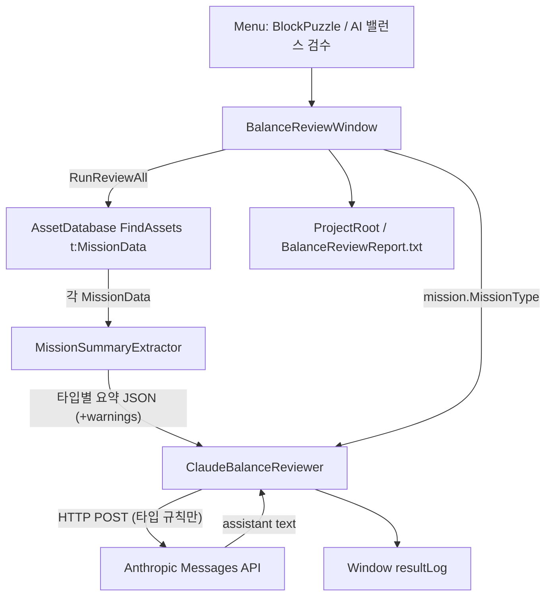
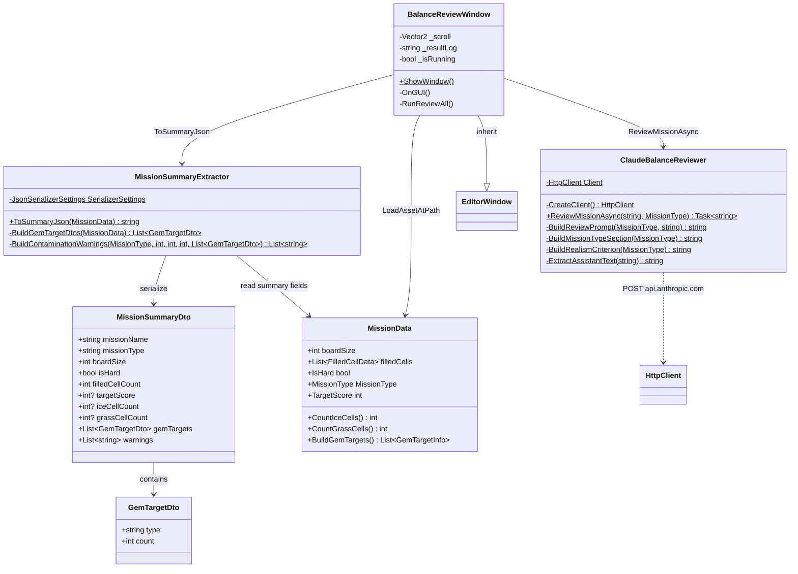

# AI Balance Review (에디터)

에디터 전용 미션 밸런스 검수 툴. 프로젝트의 모든 `MissionData`를 요약 JSON으로 만든 뒤 Anthropic Claude API에 보내고, 난이도·목표 현실성 이슈를 로그/리포트로 남긴다. **런타임 플레이어 빌드에는 포함되지 않는다.**

경로: `Assets/1.Scripts/Editor/AIBalanceReview/`

## 책임 분리

| 클래스 | 책임 |
|--------|------|
| `BalanceReviewWindow` | EditorWindow UI, 미션 순회, 결과 표시/파일 저장 |
| `MissionSummaryExtractor` | `MissionData` → 검수용 요약 JSON. **미션 타입에 필요한 필드만** 담고, 무관한 필드에 값이 남아 있으면 `warnings`로 옮김 (null 필드는 직렬화 제외) |
| `ClaudeBalanceReviewer` | Messages API 호출, `content[0].text` 추출. **해당 타입 규칙 섹션만** 프롬프트에 조립 |

## 흐름



## 검수 기준 (프롬프트)

`ClaudeBalanceReviewer.BuildReviewPrompt(MissionType, missionJson)`는 **검수 대상 타입의 규칙 섹션 하나만** 프롬프트에 넣는다.
다른 타입 규칙은 아예 전달하지 않으므로, "무관한 필드를 무시하라"는 지시가 필요 없다.

| MissionType | 클리어 조건 | JSON에 담기는 타입 필드 |
|-------------|-------------|-----------|
| Ice | 줄 제거로 ice 칸을 전부 제거 | `iceCellCount` |
| Grass | 줄 제거로 grass 칸을 전부 제거. 잔디 줄 3연속 미스 시 인접 칸으로 1칸 전파 | `grassCellCount` |
| Gem | 슬롯에서 스폰된 젬 블록을 줄 제거로 목표 개수 수집 | `gemTargets[]` |
| ScoreGoal | `targetScore` 도달 (시간 제한 없음) | `targetScore` |

공통 필드(`missionName`, `missionType`, `boardSize`, `isHard`, `filledCellCount`)는 모든 타입에 포함된다.

공통 검수:

1. 해당 타입의 클리어 필드가 유효한가 (0/빈 값/누락이면 high)
2. `isHard`와 실제 난이도 일치 여부 (전달된 필드만으로 판단)
3. 타입별 현실성 (Ice/Grass 칸 수, Gem 목표량, ScoreGoal 점수)
4. `warnings[]` 항목은 모두 데이터 오염 → `issues`에 포함하고 riskLevel 상향

예상 응답 스키마:

```json
{
  "missionName": "string",
  "riskLevel": "low|medium|high",
  "issues": ["string"],
  "suggestion": "string"
}
```

## 요약 JSON 필드

`MissionSummaryExtractor`가 보내는 필드 (null 필드는 직렬화에서 제외):

| 필드 | 출처 | 포함 조건 |
|------|------|-----------|
| `missionName` | 에셋 이름 | 항상 |
| `missionType` | `MissionType` | 항상 |
| `boardSize` | `MissionData.boardSize` | 항상 |
| `isHard` | `IsHard` | 항상 |
| `filledCellCount` | `filledCells.Count` | 항상 |
| `targetScore` | `TargetScore` | `ScoreGoal`일 때만 |
| `iceCellCount` | `CountIceCells()` | `Ice`일 때만 |
| `grassCellCount` | `CountGrassCells()` | `Grass`일 때만 |
| `gemTargets[]` | `BuildGemTargets()` → `{ type, count }` | `Gem`일 때만 |
| `warnings[]` | 오염 검사 | 타입과 무관한 필드에 값이 남아 있을 때만 |

예: `iceCellCount > 0`인데 `missionType != Ice` → `warnings`에 `"N ice cells exist on a Gem mission (unused)."` 추가.
필드를 JSON에서 뺐기 때문에, 이 `warnings`가 없으면 AI는 오염을 볼 수 없다.

보드 셀 좌표·스프라이트 전체 목록은 보내지 않는다 (토큰/프라이버시 최소화).

## 클래스



## 사용 방법

1. OS 사용자/시스템 환경변수에 `ANTHROPIC_API_KEY` 설정 후 **Unity 에디터 재시작**
2. 메뉴 `BlockPuzzle` → `AI 밸런스 검수`
3. `모든 미션 검수 실행` 클릭
4. 창 로그와 프로젝트 루트 `BalanceReviewReport.txt` 확인

## 의존성 / 제약

| 항목 | 내용 |
|------|------|
| 패키지 | `com.unity.nuget.newtonsoft-json` (요청/응답 JSON) |
| API | `https://api.anthropic.com/v1/messages`, 모델 `claude-sonnet-4-6` |
| Timeout | HttpClient 60초 |
| 실행 | 에디터 전용 (`Editor` 폴더). 미션마다 **순차** 호출 → 미션 수에 비례해 시간·비용 증가 |
| 실패 | API 키 없음 / HTTP 오류 / 파싱 실패 시 Console 로그 + 창에 `(검수 실패 — Console 로그 확인)` |

## 관련 코드

- `Assets/1.Scripts/InGame/Board/MissionData.cs` — 검수 대상 ScriptableObject
- `Assets/1.Scripts/LevelMap/Mission/GemTargetInfo.cs` — gem 목표 구조체
