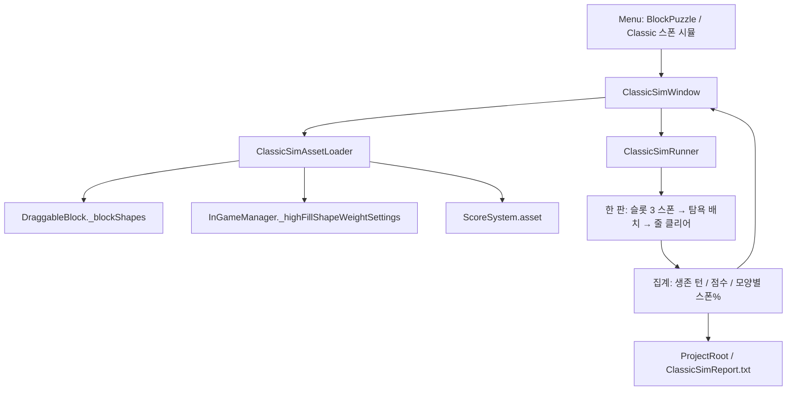
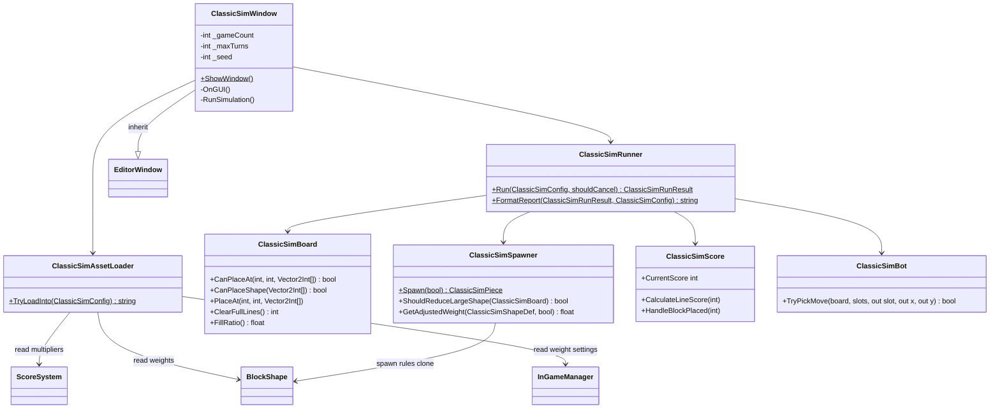

# Classic Spawn Sim (에디터)

Classic 모드 스폰 가중치를 검수하는 에디터 전용 시뮬레이터.
`BlockShape` 가중치와 보드 점유율 감쇠를 복제한 뒤, 탐욕 봇이 헤드리스로 N판을 플레이한다.
**런타임 플레이어 빌드에는 포함되지 않는다. Claude API를 호출하지 않는다.**

경로: `Assets/1.Scripts/Editor/ClassicSim/`

## 책임 분리

| 클래스 | 책임 |
|--------|------|
| `ClassicSimWindow` | EditorWindow UI, 진행 바, 리포트 저장 |
| `ClassicSimAssetLoader` | `DraggableBlock`·`InGameManager` 프리팹·`ScoreSystem` 에셋에서 가중치/점수 공식 로드 |
| `ClassicSimRunner` | N판 루프, 통계 집계, 리포트 문자열 |
| `ClassicSimBoard` | 점유 그리드, 배치 가능, 줄 클리어 |
| `ClassicSimSpawner` | 가중치 선택, 랜덤 회전, 50% 점유 시 대형 감쇠·소형 증가 |
| `ClassicSimScore` | `ScoreSystem` 공식 복제 (SFX 없음) |
| `ClassicSimBot` | 남은 슬롯 × 좌표 중 탐욕 최고점 선택 |

## 흐름

## 복제하는 런타임 규칙

- 보드 `9x9`, 슬롯 3, 빈 보드 시작
- 배치 좌표: `tx = baseX + offset.x`, `ty = baseY - offset.y` (`BoardModel`과 동일)
- 형태 가중치 + 0~3 회전 후 정규화 (`DraggableBlock`)
- 점유율 50%(`_startFillRatio`) 이상이면 칸 수 5 이상 블록 가중치 × 0.7, 칸 수 3 이하 블록 가중치 × 1.3 (`InGameManager._highFillShapeWeightSettings` 기본값, 스폰 시 `DraggableBlock`에 전달)
- 점수: 배치 칸 수 + 줄 점수/콤보. 호출 순서는 런타임과 같이 줄 점수 먼저, 배치 점수 나중
- 게임오버: 남은 슬롯 블록을 하나도 놓을 수 없음
- ice / grass / gem / VFX / 저장은 복제하지 않음

## 봇

한 수: 남은 슬롯 블록의 모든 좌표를 훑고 아래 점수가 가장 큰 수를 고른다.

1. 지워지는 줄 수
2. 6칸 이상 찬 행/열 수
3. 클리어 후 남은 칸은 적을수록 좋음
4. 이번 수 이후 남은 슬롯이 전부 못 놓으면 큰 페널티

사람 실력을 맞추지 않는다. 가중치를 바꿨을 때 생존/스폰 비율이 어떻게 변하는지만 본다.

## 클래스

## 사용 방법

1. 메뉴 `BlockPuzzle` → `Classic 스폰 시뮬`
2. 시행 판 수(기본 100), 최대 턴(기본 1000), 시드(0이면 랜덤)
3. `시뮬레이션 실행`
4. 창 로그와 프로젝트 루트 `ClassicSimReport.txt` 확인

Unity 인스펙터 연결은 필요 없다. `DraggableBlock`·`InGameManager` 프리팹과 `ScoreSystem` 에셋을 자동으로 읽는다.

## 리포트 읽는 법

| 값 | 의미 |
|----|------|
| 평균 생존 턴 / 평균 점수 | 이 봇이 현재 스폰 테이블에서 얼마나 오래 사는가. 절대값이 아니라 가중치 변경 전후 비교용 |
| 실제% | 시뮬에서 그 모양이 나온 비율 |
| 빈보드기대% | 점유 50% 미만일 때 가중치 비율 |
| 50%이상기대% | 큰 블록 감쇠가 켜진 뒤의 가중치 비율 |

실제%는 저점유·고점유 스폰이 섞이므로 두 기대값 사이에 있는 것이 정상이다.

## 관련 코드

- `Assets/1.Scripts/InGame/DraggableBlock.cs` — 가중치 선택·회전
- `Assets/1.Scripts/Manager/InGameManager.cs` — 50% 점유 시 큰 블록 감소 설정 소유, 슬롯 리필
- `Assets/1.Scripts/InGame/Board/HighFillShapeWeightSettings.cs` — 고점유 가중치 감쇠 설정값
- `Assets/1.Scripts/InGame/Board/BoardModel.cs` — 배치 좌표·줄 클리어
- `Assets/1.Scripts/ScoreSystem.cs` — 점수 공식
- `Assets/3.ScriptableObjects/Blocks/` — BlockShape 가중치
