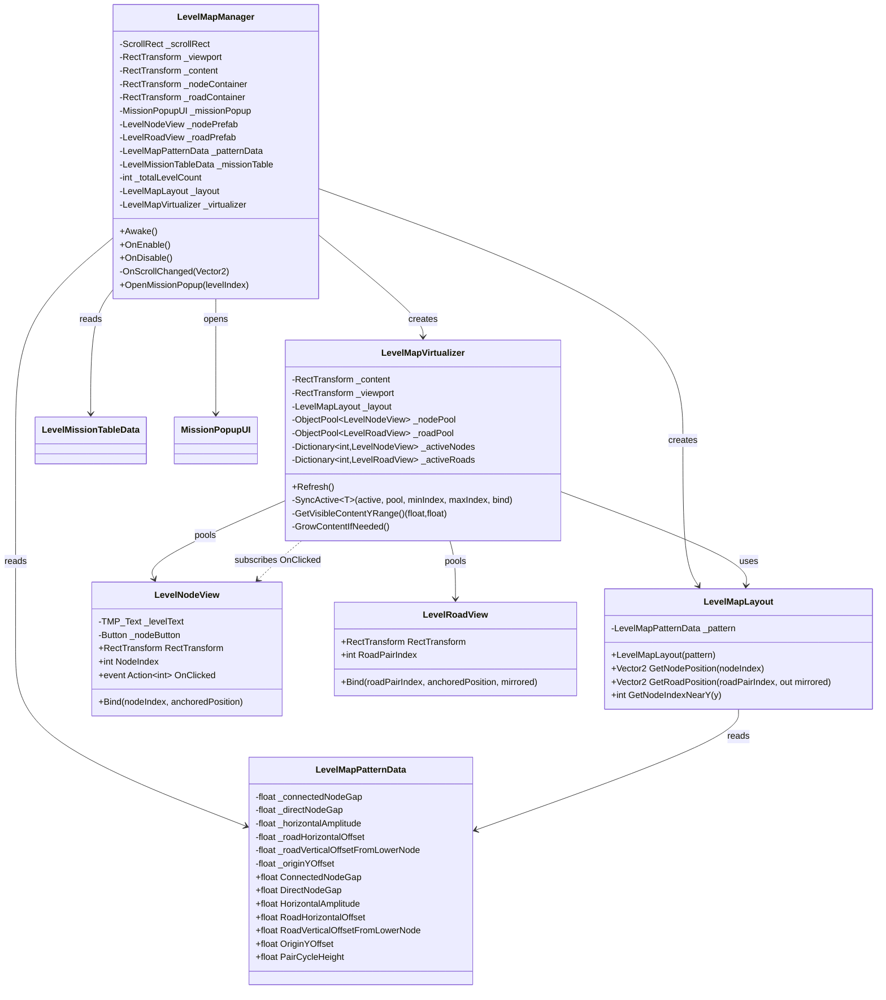
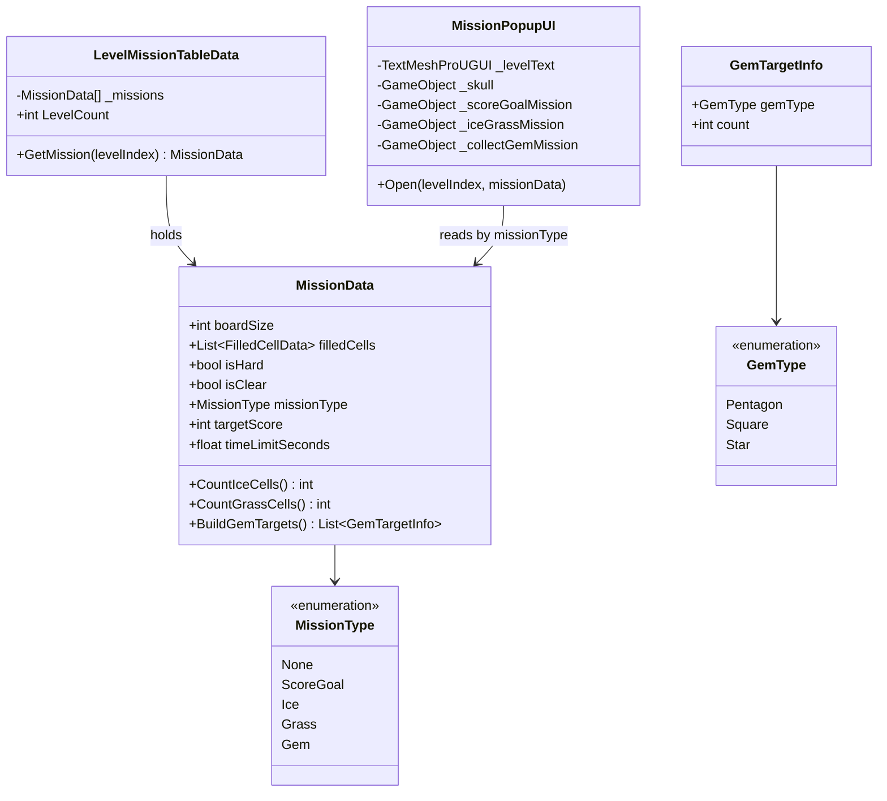
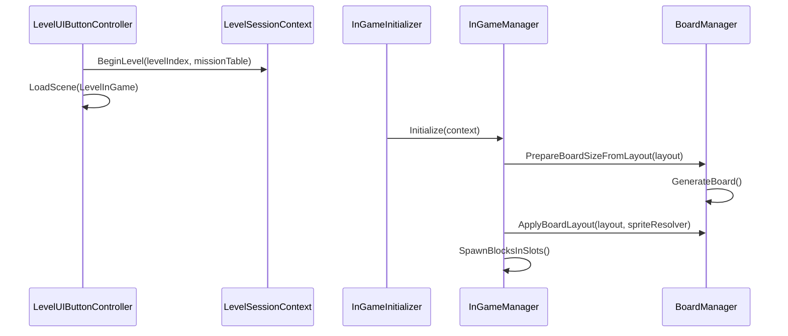

# LevelMap 가상 스크롤 구조

Level 씬의 ScrollView(Content > LoadPreview)에서 손으로 배치했던 Road/LevelNode 반복 패턴을
동적으로 생성하도록 가상화한 구조. Content는 하단(pivot 0,0) 기준으로 위로 자라나며,
스크롤을 위로 올릴수록 상위 레벨이 드러난다.

## 클래스 다이어그램

노드 클릭 시 `LevelNodeView.OnClicked(nodeIndex)` 이벤트가 발생하고, `LevelMapVirtualizer`가 노드 생성 시점(풀링되므로 1회만)에 이를 `LevelMapManager.OpenMissionPopup`으로 구독시켜 전달한다. `LevelNodeView`는 `LevelMapManager`를 직접 참조하지 않는다(Action 기반 설계).

## 레벨 클리어 미션 데이터

레벨마다 클리어 조건이 다르므로, `MissionData` 하나로 보드 배치와 미션 메타를 담는다.
Ice/Grass/Gem 목표 개수는 `filledCells`에서 산출하고, ScoreGoal만 `targetScore` / `timeLimitSeconds`를 별도 필드로 둔다.

> `MissionPopupUI.Open`은 `missionType`에 따라 점수 목표/블록 수집/보석 수집 UI 그룹 중
> 하나만 활성화하고 내용을 채운다. Ice/Grass/Gem 개수는 보드 셀에서 자동 산출한다.
> 실제 인게임 클리어 판정 로직(예: `MissionEvaluator`)은 아직 구현되어 있지 않다.

## 배치 규칙 (기존 씬 실측값 기반)

- 노드 인덱스 `n`의 X좌표: `amplitude * [0, +1, 0, -1][n % 4]` (4개 주기 지그재그)
- 노드 인덱스 `n`의 Y좌표: 2개 노드 + Road 1개가 한 주기(`PairCycleHeight = connectedGap + directGap`)
  - 짝수→홀수: `connectedGap`(180.5) 간격, 그 사이에 Road 배치
  - 홀수→다음 짝수: `directGap`(190.5) 간격, Road 없이 직결
- Road는 자신이 연결하는 두 노드 중 아래쪽(짝수 인덱스) 노드보다 `roadVerticalOffsetFromLowerNode`(178.5)만큼 위,
  가로로는 `roadHorizontalOffset`(217)만큼 좌우로 벌어진 위치에 놓이고, 좌회전 구간에서는 동일 스프라이트를
  Y축 180도 회전시켜 재사용한다.

## 가상 스크롤 동작

1. `LevelMapManager.Awake()`가 `LevelMapLayout`과 `LevelMapVirtualizer`를 구성하고, ScrollRect를 하단(0)으로 초기화한다.
   생성되는 LevelNode는 `_nodeContainer`(Content 하위 "LevelNode" 트랜스폼) 자식으로, Road는 `_roadContainer`
   ("Road" 트랜스폼) 자식으로 각각 나뉘어 들어간다.
2. `ScrollRect.onValueChanged` 이벤트가 발생할 때만 `LevelMapVirtualizer.Refresh()`가 호출된다(Update 폴링 없음).
3. `Refresh()`는 Viewport의 월드 코너를 Content 로컬 좌표로 변환해 현재 보이는 Y 범위를 구하고,
   그 범위(+여유값) 밖의 노드/도로는 `ObjectPool`로 반환, 범위 안에 없는 것은 새로 스폰한다.
4. 전체 레벨 수가 정해지지 않은 경우(`_totalLevelCount <= 0`), 스크롤이 상단 여유값에 가까워질 때마다
   Content의 `sizeDelta.y`를 `_contentGrowthChunk`만큼 늘려 계속 위로 스크롤할 수 있게 한다.

## 레벨 인게임 진입 / 보드 초기화

- `MissionData`가 보드 크기와 초기 채움 칸을 정의한다.
- 레벨 모드에서는 Classic 저장(`InGameSaveStorage`)을 사용하지 않는다.
