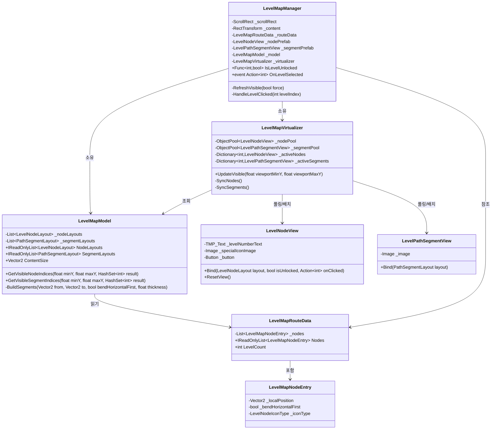
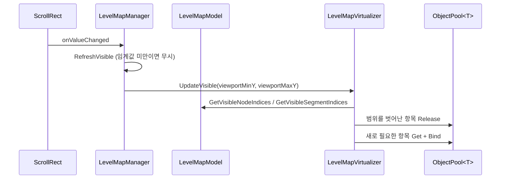

# 레벨 맵 (Level Map)

`Assets/1.Scripts/LevelMap/` — 긴 레벨 경로/노드를 미리 전부 생성해두지 않고, 스크롤 중 뷰포트에
걸치는 부분만 오브젝트 풀에서 동적으로 배치/회수하는 가상화(virtualization) 방식의 레벨 맵.

## 구조

## 흐름

## 설계 메모

- **경로는 authoring하지 않는다**: `LevelMapRouteData`는 노드 좌표(`LevelMapNodeEntry.LocalPosition`)만 갖고,
  인접한 두 노드 사이의 경로 막대(`PathSegmentLayout`)는 `LevelMapModel.BuildSegments`가 자동으로 계산한다.
  좌표가 대각선으로 어긋나면 `BendHorizontalFirst` 값에 따라 L자 형태로 두 개의 막대를 만든다.
- **가시성 판정은 선형 스캔**: 노드가 인덱스 순으로 Y좌표가 대체로 단조 변화한다는 전제(맵 아트가 대체로 한 방향으로
  전진하는 형태)로 `LevelMapModel`이 매 갱신마다 전체를 훑어 뷰포트에 걸치는 인덱스를 찾는다. 레벨 수가
  수백~수천 단위를 크게 넘지 않는 한(스크롤 갱신은 임계값 이상 이동했을 때만 실행됨) 성능 문제가 없다.
- **잠금/별점 저장은 이번 범위 밖**: `LevelMapManager.IsLevelUnlocked`(Func 훅)만 열어두었고, 기본값(null)이면
  전부 해제 상태로 렌더링한다. 추후 PlayerPrefs 기반 진행도 저장을 연동할 때 이 훅에 함수만 꽂으면 되고
  맵 렌더링/가상화 코드는 수정할 필요가 없다.
