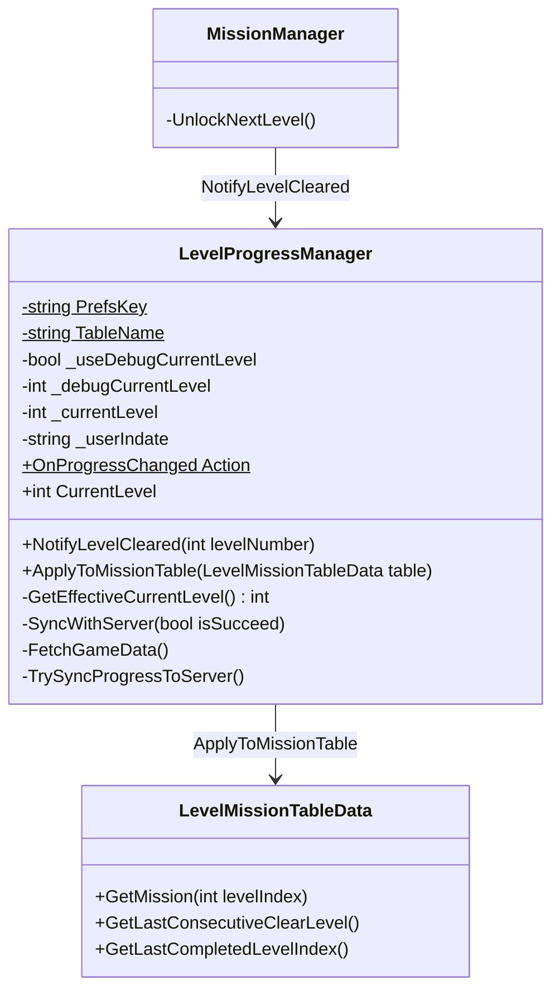

# LevelProgressManager 구조

레벨 진행도(현재 플레이 레벨)의 로컬 영속화와 뒤끝 서버 동기화.

## 책임 분리

| 클래스 | 책임 |
|--------|------|
| `LevelProgressManager` | `currentLevel` 로컬/서버 동기화, Debug 오버라이드, `MissionData.isClear` 파생 적용 |
| `MissionManager` | 클리어 시 `NotifyLevelCleared` 호출 |
| `LevelMapManager` / `LevelUIButtonController` | 맵 진입·진행 변경 시 Apply + UI refresh |
| `LeaderboardManager` | 점수/랭킹만 담당 (레벨 진행과 분리) |

## 저장 의미

- `currentLevel`: 현재 플레이 레벨 번호 (1-base). 미진행 = `1`
- 레벨 N 클리어 시 `currentLevel = N + 1`
- 런타임 `isClear` 파생: `isClear = (levelIndex < effectiveCurrentLevel)`
  - 예: `effectiveCurrentLevel=4` → 레벨 1~3 완료, 레벨 4까지 해금

## 테스트용 진행도 오버라이드

- Debug 설정은 `LevelProgressManager` 인스펙터의 `Debug/Test` 섹션(`_useDebugCurrentLevel`, `_debugCurrentLevel`)에 둔다.
- `ApplyToMissionTable(table)`은 항상 `GetEffectiveCurrentLevel()`을 사용하므로, `LevelMapManager` / `LevelUIButtonController` / `MissionManager` 호출이 같은 기준을 공유한다.
- `_debugCurrentLevel`은 현재 플레이 레벨(1-base)이며, 저장값 변환 없이 그대로 적용한다. (예: Current Level=4 → 1~3 클리어, 4가 현재 위치)
- 실제 저장 데이터(PlayerPrefs/서버)는 변경되지 않는다. DDOL 싱글톤이므로 Lobby에서 진입하면 Lobby 인스턴스 값이 유지되고, Level 씬을 직접 열면 해당 씬 오버라이드가 적용된다. 테스트 후 반드시 체크박스를 해제할 것.

## 동기화 흐름

## 로그인 시 Max 병합

## 클래스

## 뒤끝 테이블

| 테이블 | 컬럼 | 타입 |
|--------|------|------|
| `LEVEL_PROGRESS` | `currentLevel` | Number (int) |
