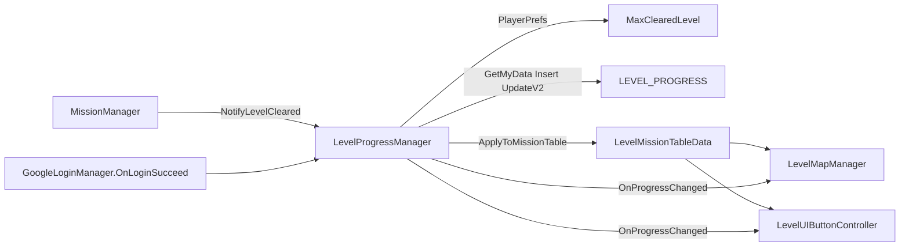
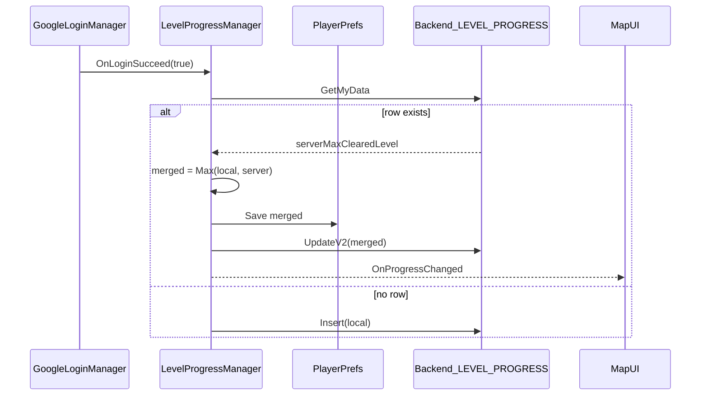
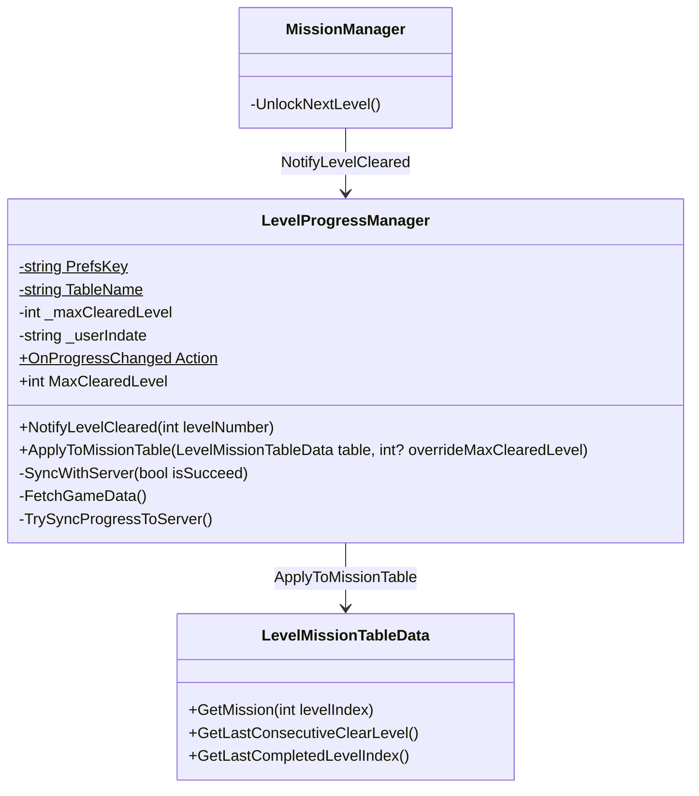

# LevelProgressManager 구조

레벨 클리어 진행도(최고 클리어 레벨)의 로컬 영속화와 뒤끝 서버 동기화.

## 책임 분리

| 클래스 | 책임 |
|--------|------|
| `LevelProgressManager` | `maxClearedLevel` 로컬/서버 동기화, `MissionData.isClear` 파생 적용 |
| `MissionManager` | 클리어 시 `NotifyLevelCleared` 호출 |
| `LevelMapManager` / `LevelUIButtonController` | 맵 진입·진행 변경 시 Apply + UI refresh |
| `LeaderboardManager` | 점수/랭킹만 담당 (레벨 진행과 분리) |

## 저장 의미

- `maxClearedLevel`: 클리어 완료한 최고 레벨 번호 (1-base). 미클리어 = `0`
- 런타임 `isClear` 파생: `isClear = (levelIndex <= maxClearedLevel)`
  - 예: `maxClearedLevel=3` → 레벨 1~3 완료, 레벨 4까지 해금

## 테스트용 진행도 오버라이드

- `ApplyToMissionTable(table, overrideMaxClearedLevel)`의 두 번째 인자에 값을 넘기면 실제 `PlayerPrefs` 진행도 대신 그 값으로 `isClear`를 재적용한다.
- `LevelMapManager` 인스펙터의 `Debug/Test` 섹션(`_useDebugMaxClearedLevel`, `_debugMaxClearedLevel`)에서 켜고 끌 수 있으며, ClearRoad 등 진행도 UI를 에디터에서 빠르게 확인할 때 사용한다.
- 실제 저장 데이터(PlayerPrefs/서버)는 변경되지 않으며, 플레이 모드 종료 후 값은 유지되므로 테스트 후 반드시 체크박스를 해제할 것.

## 동기화 흐름

## 로그인 시 Max 병합

## 클래스

## 뒤끝 테이블

| 테이블 | 컬럼 | 타입 |
|--------|------|------|
| `LEVEL_PROGRESS` | `maxClearedLevel` | Number (int) |
