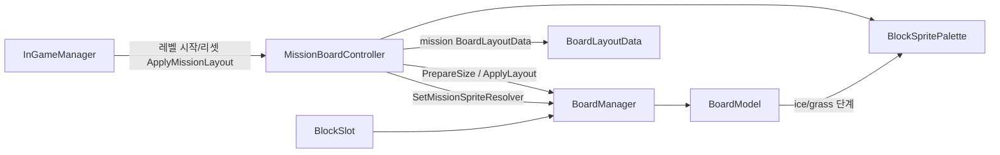
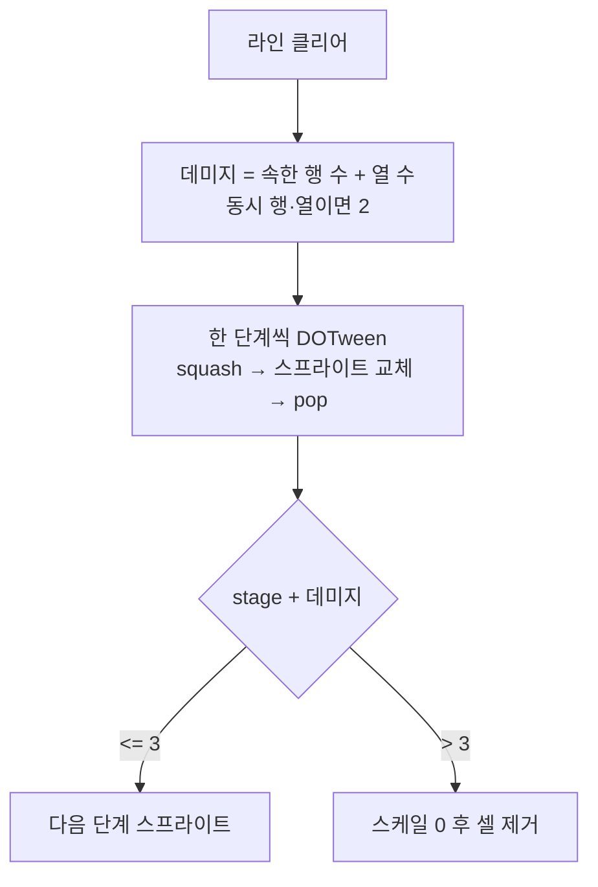
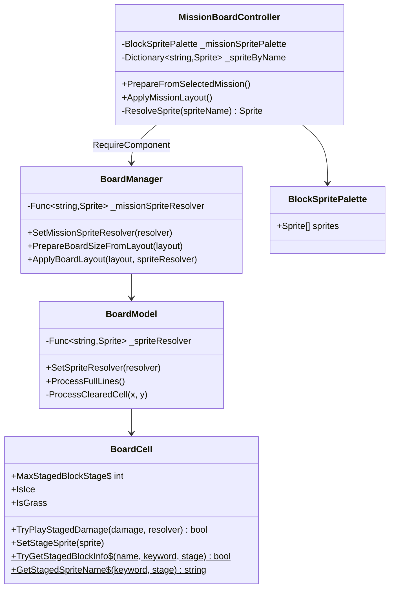

# MissionBoardController 구조

미션 레이아웃·팔레트는 `MissionBoardController`가 담당하고,
보드 코어(배치/프리뷰/힌트/라인 클리어)는 `BoardManager`가 담당한다.

## 의존 관계

## ice / grass 단계 클리어

- ice01/grass01 + 줄 1개 → 02 (DoTween)
- 가로·세로 동시 → 데미지 +2, 단계를 한 칸씩 연출
- 03 + 추가 데미지 → 제거 연출

## 클래스

## 실행 순서

1. `MissionBoardController` (`DefaultExecutionOrder -95`) Awake  
   - 팔레트 룩업 구축 후 `SetMissionSpriteResolver` 등록
   - 레벨 세션이면 `PrepareBoardSizeFromLayout`
2. `BoardManager` (`-90`) Awake  
   - `GenerateBoard` + 리졸버를 `BoardModel`에 전달
3. `InGameManager` Start  
   - 레벨이면 `ApplyMissionLayout` → 셀 채움/stone/ice/grass 적용

## 인스펙터 설정

1. `BoardManager`에 `MissionBoardController` 추가
2. **Mission Sprite Palette**에 `Assets/3.ScriptableObjects/Level/BlockSpritePalette` 연결
3. 팔레트 `Sprites`에 `ice01~03`, `grass01~03` 포함 (단계 전환·연출용)
