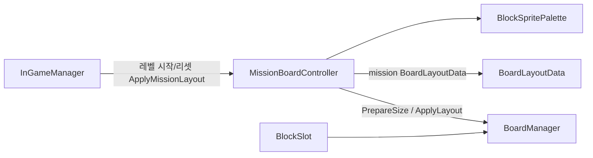
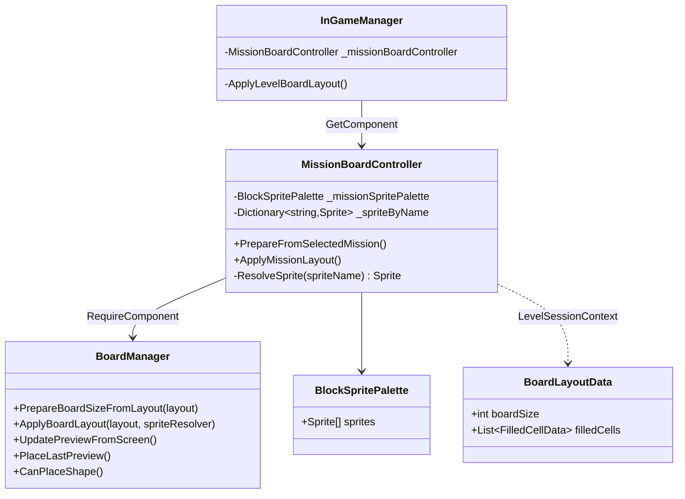

# MissionBoardController 구조

미션 레이아웃·팔레트는 `MissionBoardController`가 담당하고,
보드 코어(배치/프리뷰/힌트/라인 클리어)는 `BoardManager`가 담당한다.

## 의존 관계

## 클래스

## 실행 순서

1. `MissionBoardController` (`DefaultExecutionOrder -95`) Awake  
   - 레벨 세션이면 `PrepareBoardSizeFromLayout`
2. `BoardManager` (`-90`) Awake  
   - `GenerateBoard`
3. `InGameManager` Start  
   - 레벨이면 `ApplyMissionLayout` → 셀 채움/stone 적용

## 인스펙터 설정

1. `BaordManager` 프리팹(또는 씬의 BoardManager 오브젝트)에 `MissionBoardController` 추가
2. **Mission Sprite Palette**에 `Assets/3.ScriptableObjects/Level/BlockSpritePalette` (Board Layout Editor와 동일 에셋) 연결
