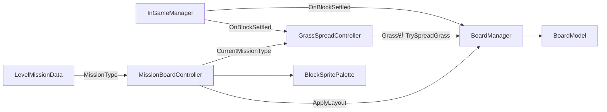
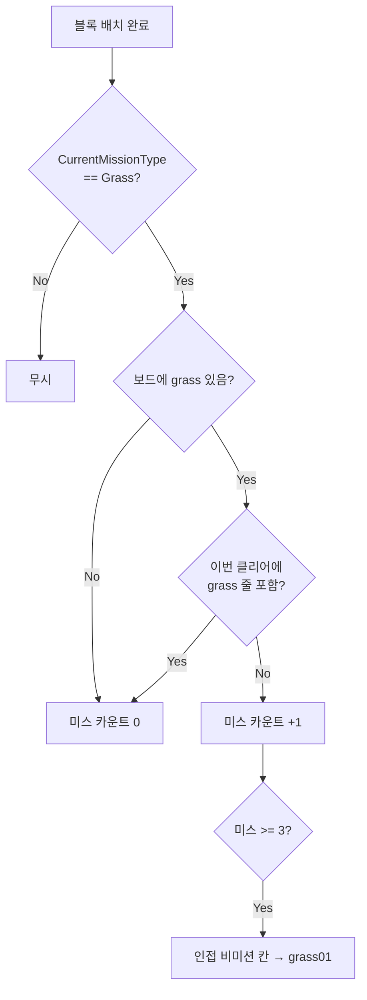
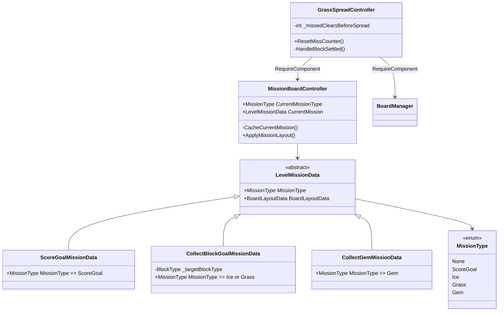

# MissionBoardController 구조

미션 레이아웃·팔레트는 `MissionBoardController`가 담당하고,
보드 코어(배치/프리뷰/힌트/라인 클리어)는 `BoardManager`가 담당한다.
grass 전파는 `GrassSpreadController`가 담당하며 **MissionType.Grass일 때만** 동작한다.

## 미션 종류

| MissionType | SO |
|-------------|-----|
| ScoreGoal | `ScoreGoalMissionData` |
| Ice | `CollectBlockGoalMissionData` (Target=Ice) |
| Grass | `CollectBlockGoalMissionData` (Target=Grass) |
| Gem | `CollectGemMissionData` |
| None | 레벨 세션 아님 |

한 미션에 Ice/Grass가 섞이지 않는다.

## 의존 관계

## grass 전파

## 클래스

## 인스펙터 설정

1. BoardManager에 `MissionBoardController` + `GrassSpreadController` 추가
2. Collect Block 미션 SO의 **Target Block Type**으로 Ice/Grass 구분 (MissionType은 자동)
3. 팔레트에 `grass01~03` 포함 (Grass 미션 전파용)
