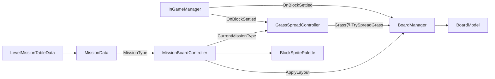
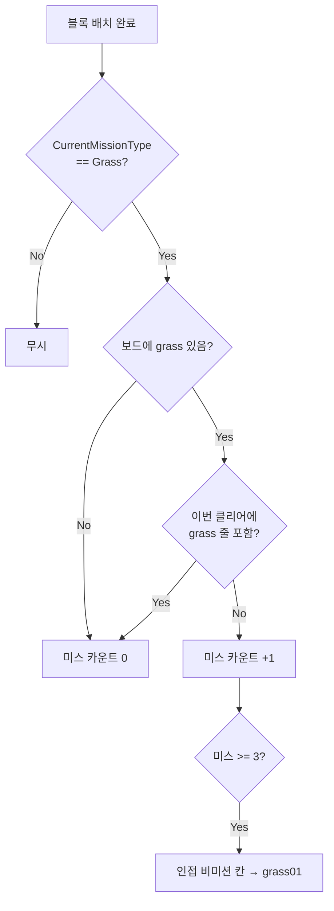
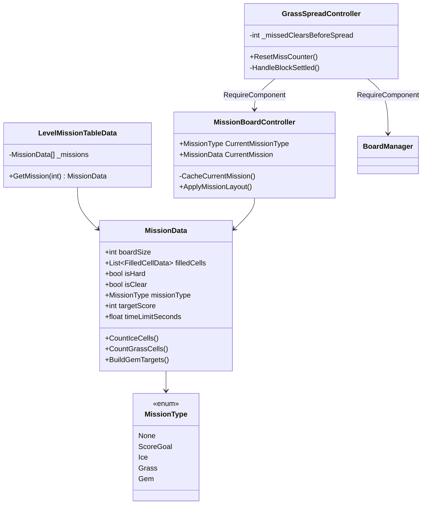

# MissionBoardController 구조

미션 레이아웃·팔레트는 `MissionBoardController`가 담당하고,
보드 코어(배치/프리뷰/힌트/라인 클리어)는 `BoardManager`가 담당한다.
grass 전파는 `GrassSpreadController`가 담당하며 **MissionType.Grass일 때만** 동작한다.

## 미션 종류

| MissionType | 판별 기준 | 목표 수치 |
|-------------|-----------|-----------|
| ScoreGoal | 비어 있음 또는 stone만 | `targetScore` / `timeLimitSeconds` |
| Ice | ice 셀 존재 | `CountIceCells()` |
| Grass | grass 셀 존재 | `CountGrassCells()` |
| Gem | Pentagon/Square/Star | `BuildGemTargets()` |
| None | 레벨 세션 아님 | - |

한 미션에 Ice/Grass가 섞이지 않는다. 우선순위: Grass > Ice > Gem > ScoreGoal.

## 의존 관계

## grass 전파

## 클래스

## Mission Maker

`MissionMaker`는 보드 채움 + 미션 메타(`isHard` / `isClear` / `missionType`)를
`MissionData` ScriptableObject로 저장한다.
ScoreGoal일 때만 `targetScore` / `timeLimitSeconds`를 편집한다.

## 인스펙터 설정

1. BoardManager에 `MissionBoardController` + `GrassSpreadController` 추가
2. `LevelMissionTable`의 미션 슬롯에 `MissionData` 연결
3. 팔레트에 `grass01~03` 포함 (Grass 미션 전파용)
