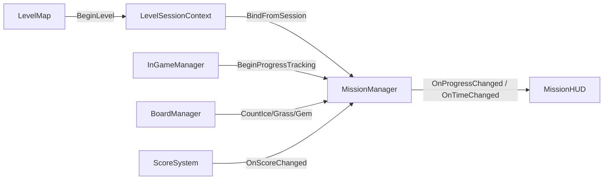
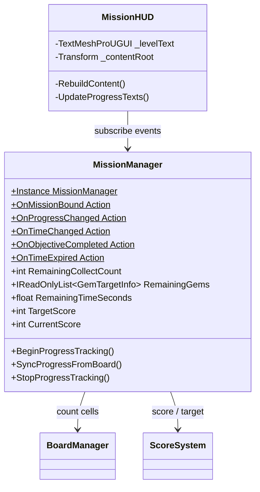
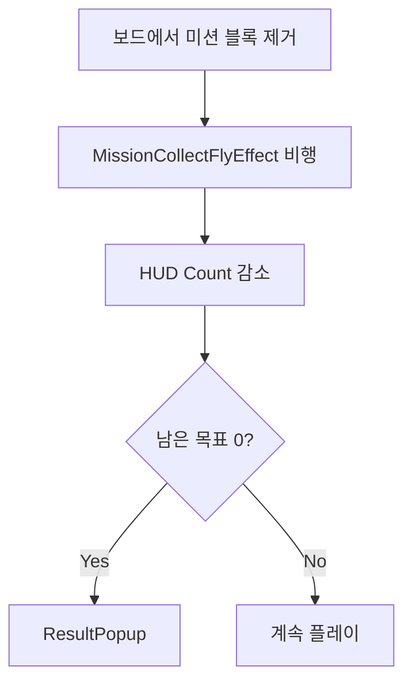

# MissionManager / MissionHUD 구조

LevelInGame 씬의 미션 세션·진행도·HUD 표시.

## 책임 분리

| 클래스 | 책임 |
|--------|------|
| `LevelSessionContext` | 씬 간 전달 (정적, 진입 전 BeginLevel) |
| `MissionManager` | 세션 캐시 + **진행도** (남은 Ice/Grass/Gem, 시간, 점수 목표) |
| `MissionHUD` | 레벨/남은 수/시간 **표시만** |
| `MissionBoardController` | 보드 레이아웃·팔레트 적용 |
| `InGameManager` | 게임 루프, 인트로 후 `BeginProgressTracking` 호출 |

## 흐름

## 진행도 규칙

| MissionType | 남은 목표 | 갱신 시점 |
|-------------|-----------|-----------|
| Ice | 보드 ice 셀 수 | 블록 배치 후 (스테이지 제거 연출 포함) |
| Grass | 보드 grass 셀 수 (전파 반영) | 동일 |
| Gem | 종류별 보드 gem 셀 수 | 동일 |
| ScoreGoal | `RemainingTimeSeconds` + `CurrentScore`/`TargetScore` | 타이머 코루틴 / 점수 이벤트 |

인트로·레이아웃 적용이 끝난 뒤 `BeginProgressTracking()`을 호출해야 타이머가 시작한다.

## 클래스

## 수집 비행 연출

미션 블록(Ice/Grass/Gem) 제거 시 HUD 아이콘으로 날아간 뒤에만 Count가 줄고,
모든 비행이 끝난 뒤 목표가 0이면 ResultPopup이 열린다.

### 인스펙터

**MissionManager**
- `_testMissionData` → 테스트용 MissionData (연결 시 레벨맵 없이 LevelInGame Play)
- `_testLevelNumber` → HUD/결과에 표시할 레벨 번호
- `_missionHud` → MissionHUD
- `_flyEffect` → MissionCollectFlyEffect
- `_resultPopup` → ResultPopupUI

**MissionCollectFlyEffect**
- `_flyRoot` → Canvas RectTransform
- `_flyIconPrefab` → IconImage
- `_flyDuration` → 비행 시간(초). **작을수록 빠름** (0.05~1.5)
- `_arcHeight` → 포물선 높이
- `_spinTurns` → 비행 중 회전 횟수 (0 = 회전 없음)
- `_endScale` → 도착 시 크기

| 결과 | ResultText | Level | 트리거 |
|------|------------|-------|--------|
| 성공 | SUCCESS | Level  N | 목표 달성 |
| 실패 | FAIL | Level  N | 시간 초과 / 배치 불가 게임오버 |

- Retry → 같은 레벨 `ResetGame`
- Quit → `ClearSession` 후 Level 맵 씬 이동
- 성공 시 다음 레벨 `MissionData.isClear = true` (플레이 가능 해금)

## 인스펙터 설정 (ResultPopup)

1. ResultPopup에 `ResultPopupUI` 추가
2. `_canvasGroup` → ResultPopup CanvasGroup
3. `_popupTransform` → Result
4. `_resultText` → ResultText, `_levelText` → Level
5. `_retryButton` / `_quitButton` 연결
