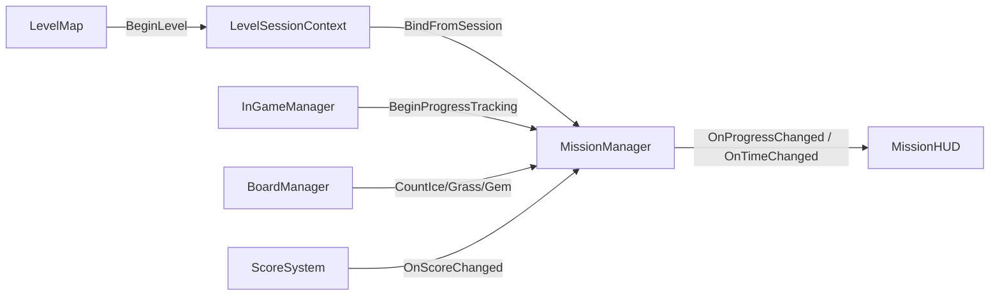
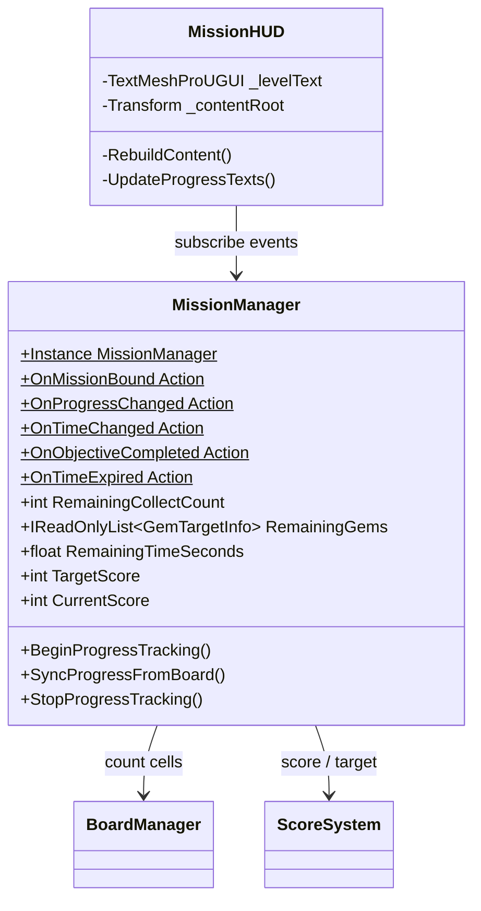

# MissionManager / MissionHUD 구조

LevelInGame 씬의 미션 세션·진행도·HUD 표시.

## 책임 분리

| 클래스 | 책임 |
|--------|------|
| `LevelSessionContext` | 씬 간 전달 (정적, 진입 전 BeginLevel) |
| `MissionManager` | 세션 캐시 + **진행도** (남은 Ice/Grass/Gem, 시간, 점수 목표) |
| `MissionHUD` | 레벨/남은 수/시간 **표시만** |
| `MissionBoardController` | 보드 레이아웃·팔레트 적용 |
| `InGameManager` | 게임 루프, 인트로 후 `BeginProgressTracking` 호출 |

## 흐름

## 진행도 규칙

| MissionType | 남은 목표 | 갱신 시점 |
|-------------|-----------|-----------|
| Ice | 보드 ice 셀 수 | 블록 배치 후 (스테이지 제거 연출 포함) |
| Grass | 보드 grass 셀 수 (전파 반영) | 동일 |
| Gem | 종류별 보드 gem 셀 수 | 동일 |
| ScoreGoal | `RemainingTimeSeconds` + `CurrentScore`/`TargetScore` | 타이머 코루틴 / 점수 이벤트 |

인트로·레이아웃 적용이 끝난 뒤 `BeginProgressTracking()`을 호출해야 타이머가 시작한다.

## 클래스

## 인스펙터 설정 (MissionHUD)

1. LevelInGame의 `Mission` UI에 `MissionHUD` 추가
2. `_root` → Mission 오브젝트
3. `_contentRoot` → `LayoutGroup` (HorizontalLayoutGroup)
4. `_iconPrefab` → `Assets/2.Prefabs/Level/Mission/GemIcon.prefab` (또는 Image 프리팹)
5. `_countPrefab` → `Assets/2.Prefabs/Mission/Count1.prefab` (또는 Count10)
6. `_timePrefab` → `Assets/2.Prefabs/Mission/Time.prefab`
7. 아이콘 스프라이트 연결
   - Ice/Grass: `Assets/10.Resources/Mission/ice01`, `grass01`
   - Time: `TimeIcon`
   - Gem: `Pentagon` / `Square` / `Star`
8. (선택) `_levelText`에 레벨 TMP 연결

## 실행 순서

| 클래스 | DefaultExecutionOrder |
|--------|----------------------|
| InGameInitializer | -200 |
| MissionManager | -110 |
| InGameManager | -100 |
| MissionBoardController | -95 |
| BoardManager | -90 |
